# Dash Airbnb

## 📋 Summary

- [📖 About project](#about-project)
- [🏗️ Architecture](#architecture)
- [🛠️ Technologies used](#technologies-used)
- [📋 Requirements](#requirements)
- [🚀 How to run](#how-to-run)
- [👨‍💻 Authors](#authors)

## 📖 About Project 

This project contains 2 interactive analyses:
- Sales Analysis, using the Pygwalker library in a Jupyter Notebook.
- Dashboard about Airbnb in Rio de Janeiro, using Pygwalker and Streamlit.

```mermaid
graph LR
    A[📦 Vendas.csv] -->| Ingestion | B(⚡Python) 
    B -->|Transformation| C[📊 Streamlit]
    
    style A fill:#134647,stroke:#333,stroke-width:2px
    style B fill:#0074b4,stroke:#333,stroke-width:2px
    style C fill:#69b,stroke:#333,stroke-width:2px

```

## 🏗️ Achitecture 

## 🛠️ Technologies used 

- Python
    - Pandas
    - Pygwalker
    - Streamlit
    - Plotly

## 📋 Requirements 

- Python 3.11
- IDE of your choice (VSCode, PyCharm, Databricks, etc.)

## 🚀 How to run 

- Clone or download the repository
- Open the project in the terminal and navigate to the project directory
- Create a virtual environment using: ``python -m venv .venv``
- Activate the virtual environment:
    - On Windows: ``.venv\Scripts\activate``
    - On MacOS/Linux: ``source .venv/bin/activate``
- Install the project dependencies:
    ``pip install -r requirements.txt``
- Open the project in your preferred code editor
- To run the dashboard, in the terminal, while being in the project folder and with the environment activated, execute:
    ``streamlit run dash_airbnb_v2.py``

## 👨‍💻 Authors 

- [Matheus Rodrigues](https://www.linkedin.com/in/matheus-rodrigues-mrj/)